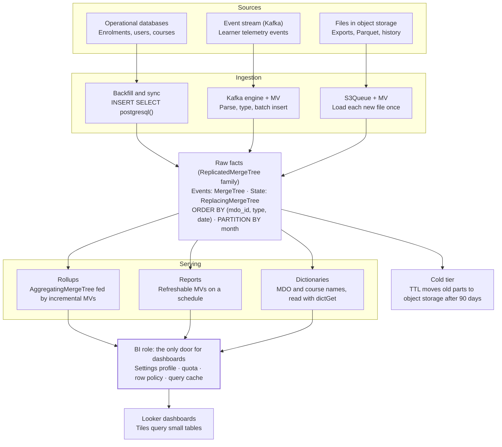

# ClickHouse: Zero to Hero — An Architect's Field Guide

> A plain-language walk through every area of the official [ClickHouse Reference docs](https://clickhouse.com/docs/reference/home) — with stories, right-vs-wrong patterns, and a design playbook.
>
> *As of 2 October 2026.*

## Table of contents

- [Part 0 — The mental model: ClickHouse is fast because it reads less](#part-0--the-mental-model-clickhouse-is-fast-because-it-reads-less)
- [Part 1 — Engines I: the MergeTree family](#part-1--engines-i-the-mergetree-family-the-heart-of-clickhouse)
- [Part 2 — Engines II: special, integration, log and database engines](#part-2--engines-ii-special-integration-log-and-database-engines)
- [Part 3 — Data types: smaller columns are faster columns](#part-3--data-types-smaller-columns-are-faster-columns)
- [Part 4 — SQL reference: the dialect, the traps and the superpowers](#part-4--sql-reference-the-dialect-the-traps-and-the-superpowers)
- [Part 5 — Functions](#part-5--functions-a-toolbox-of-1000-tools-and-the-30-you-will-use-daily)
- [Part 6 — Formats: how data enters and leaves](#part-6--formats-how-data-enters-and-leaves)
- [Part 7 — Settings: hundreds of knobs, a dozen that matter](#part-7--settings-hundreds-of-knobs-a-dozen-that-matter)
- [Part 8 — System tables: ClickHouse explains itself in SQL](#part-8--system-tables-clickhouse-explains-itself-in-sql)
- [Part 9 — Data lakes: query the lake, or bring the water home](#part-9--data-lakes-query-the-lake-or-bring-the-water-home)
- [Part 10 — The architect's playbook](#part-10--the-architects-playbook-putting-it-all-together)
- [Sources](#sources)

---

## Part 0 — The mental model: ClickHouse is fast because it reads less

If you remember one sentence from this guide, make it this: ClickHouse is fast because it skips almost all of your data, not because it reads data quickly. Every good design choice helps it skip more. Every bad one forces it to read everything.

### How this guide is organised

The [Reference docs](https://clickhouse.com/docs/reference/home) have eight menu areas: SQL Reference, Data Types, Engines, Functions, Formats, Settings, System Tables and Data Lakes. Parts 1–9 walk through all of them, in the order an architect needs them. Part 10 puts everything together into one real design.

Each concept follows the same rhythm, so you can skim or study:

- **In plain words** — the idea with no jargon.
- **Story** — an anecdote or analogy that makes it stick.
- **Right way / Wrong way** — the pattern to copy and the one to avoid, usually as SQL.
- **Remember** — one line to keep in your head.

The running example is a government learning platform, like iGOT: learners, courses, enrolments, progress events, and organisations (MDOs) that watch dashboards. The patterns transfer to any analytics workload.

### Analogy: the filing cabinet vs the scrolls

A row database (PostgreSQL, MySQL) is a filing cabinet. Each learner has one folder holding every field about them. To answer "average course progress by state", you open every folder and read everything inside.

ClickHouse is a shelf of scrolls, one scroll per column. The `state` scroll and the `progress_pct` scroll are all you unroll; the other 60 columns stay on the shelf. Each scroll is also sorted and compressed, so it is short and you can jump to the right spot.

**Remember:** row stores are built to fetch one whole record fast. Column stores are built to scan a few fields across billions of records fast.

### The eight words you must own

| Term | Plain meaning | Why an architect cares |
| --- | --- | --- |
| Part | An immutable folder on disk created by each INSERT, one file per column | Too many small parts = the classic "Too many parts" failure |
| Merge | Background job that combines small parts into bigger sorted ones | Dedupe, sums and TTL happen here, so they are eventual |
| Granule | A block of rows (8,192 by default) that is the smallest unit ClickHouse reads | Skipping works granule by granule, never row by row |
| Mark | A bookmark saying where each granule starts in each column file | Lets ClickHouse jump straight into a compressed file |
| Sparse primary index | One index entry per granule, not per row | Tiny enough to live in RAM; works only for prefixes of ORDER BY |
| Partition | A coarse folder grouping of parts (for example, by month) | A data-management tool for dropping or moving data, not a speed tool |
| Shard | A slice of the data on a different server | Scales storage and CPU horizontally |
| Replica | A copy of a shard on another server | Gives high availability; coordinated by ClickHouse Keeper |

### The life of an INSERT

1. Your app sends a batch of rows.
2. ClickHouse sorts the batch by the table's `ORDER BY` and writes a brand new part. It never edits an existing part.
3. Background merges keep combining parts, the way you consolidate many sticky notes into one notebook.
4. Special engines (Replacing, Summing, Aggregating) apply their logic only during those merges. That is why their results are "eventually" correct.

### The life of a SELECT

1. **Partition pruning** — skip whole months that the `WHERE` cannot match.
2. **Primary index** — binary-search the sparse index to pick only the granules that might match.
3. **Skipping indexes** — optional extra filters that drop more granules.
4. **PREWHERE** — read only the filter columns first, then the rest for surviving rows.
5. **Vectorised, parallel execution** — process columns in chunks across all CPU cores.

### The three laws

1. **Insert big and rarely.** Thousands to hundreds of thousands of rows per insert, roughly one insert per second per table at most.
2. **Append, don't edit.** Updates and deletes exist, but they are either expensive or eventual. Design so new facts are new rows.
3. **Sort order is destiny.** Your `ORDER BY` decides which questions are fast forever, so design it from your queries.

**Story:** BigQuery bills you for bytes scanned, so you learned to select fewer columns and filter on partitions. Those habits still help in ClickHouse. The difference is that ClickHouse rewards you a second time, through its sort order, and charges you in CPU and disk on servers you run instead of in a bill.

---

## Part 1 — Engines I: the MergeTree family (the heart of ClickHouse)

Ninety percent of your real tables will be a MergeTree variant, and their speed is decided by three clauses: `ORDER BY`, `PARTITION BY` and the engine name. Get these right on day one, because changing `ORDER BY` later means rebuilding the table.

### 1.1 ORDER BY — the most important decision you will make

**In plain words:** `ORDER BY` is how rows are physically sorted inside every part. The sparse primary index is built on it, so filters on its leading columns skip granules; filters on other columns mostly don't.

**Story:** a phone book sorted by surname, then first name. Finding "Sharma, Priya" is instant. Finding everyone named "Priya" means reading the whole book. Your `ORDER BY` is the phone book's sort order.

Rules of thumb for choosing it:

1. Start with the columns your dashboards filter on most, usually the tenant (`mdo_id`) first.
2. Put lower-cardinality columns before higher-cardinality ones; this also compresses better.
3. Put time after the tenant, often as `toDate(event_time)` or the raw timestamp.
4. Keep it short: 3–5 columns is typical. Each extra column has diminishing returns.

**Right way** — every MDO dashboard filters by organisation and date range:

```sql
CREATE TABLE learning.course_events
(
    event_time   DateTime,
    mdo_id       LowCardinality(String),
    course_id    String,
    user_id      String,
    event_type   LowCardinality(String),
    progress_pct UInt8
)
ENGINE = MergeTree
PARTITION BY toYYYYMM(event_time)
ORDER BY (mdo_id, event_type, toDate(event_time), course_id);
```

**Wrong way** — sorting by a near-unique ID first:

```sql
ORDER BY (user_id, event_time)   -- dashboards filter by mdo_id and date
```

Every MDO dashboard now scans the whole table, because `user_id` scatters each organisation across every granule. This is the single most common reason a ClickHouse migration "feels slow".

**Remember:** design `ORDER BY` from your top five `WHERE` clauses, not from your source system's primary key.

### 1.2 PRIMARY KEY vs ORDER BY — not what you think

**In plain words:** in ClickHouse the primary key is not unique and does not prevent duplicates. By default it equals `ORDER BY`. You may set a shorter `PRIMARY KEY` that is a prefix of `ORDER BY` to keep the in-memory index small.

**Wrong way:** assuming `PRIMARY KEY (enrolment_id)` will reject a second row with the same ID. It will happily store both. Deduplication is a job for ReplacingMergeTree (1.4) or your pipeline.

**Remember:** primary key = "how to find", never "how to stay unique".

### 1.3 PARTITION BY — a filing tool, not a turbo button

**In plain words:** partitions group parts into folders so you can drop, move, freeze or replace a whole chunk cheaply. Merges never cross partitions.

**Story:** partitions are the year-labelled boxes in a storeroom. You throw out the 2019 box in one move. But adding hundreds of tiny boxes does not help you find a document faster — it just fills the room with cardboard.

**Right way:** `PARTITION BY toYYYYMM(event_time)` for event data kept for years. Aim for dozens to low hundreds of partitions in total.

**Wrong way:** `PARTITION BY user_id` or `PARTITION BY toDate(event_time)` on five years of data. Thousands of partitions mean thousands of small parts that never merge, slow startup and "Too many parts" errors.

**Remember:** partition for lifecycle (TTL, drops, backfills), sort for speed.

### 1.4 The MergeTree variants — pick by what should happen during a merge

Every variant is plain MergeTree plus one rule applied when parts merge. Because merges happen "whenever", every variant is eventually consistent: query with `FINAL` or with aggregation when you need exact answers now.

| Engine | What it does at merge time | Use it for | Watch out |
| --- | --- | --- | --- |
| [MergeTree](https://clickhouse.com/docs/reference/engines/table-engines/mergetree-family/mergetree) | Just sorts and combines | Raw, append-only events and logs | Default choice; start here |
| [ReplacingMergeTree](https://clickhouse.com/docs/reference/engines/table-engines/mergetree-family/replacingmergetree) | Keeps one row per sorting key, the one with the highest version | Latest state of entities: enrolments, user profiles, CDC from PostgreSQL | Duplicates are visible until merged; use `FINAL` |
| [SummingMergeTree](https://clickhouse.com/docs/reference/engines/table-engines/mergetree-family/summingmergetree) | Adds up numeric columns for equal keys | Simple counters: daily enrolments per course | Only sums; still wrap queries in `sum()` |
| [AggregatingMergeTree](https://clickhouse.com/docs/reference/engines/table-engines/mergetree-family/aggregatingmergetree) | Merges aggregate function states | Pre-computed uniques, quantiles, averages fed by materialized views | Needs `-State` / `-Merge` combinators (Part 5) |
| [CollapsingMergeTree](https://clickhouse.com/docs/reference/engines/table-engines/mergetree-family/collapsingmergetree) | Cancels a +1 row with a matching −1 row | State changes where you can emit a "cancel" row | Order of inserts matters |
| [VersionedCollapsingMergeTree](https://clickhouse.com/docs/reference/engines/table-engines/mergetree-family/versionedcollapsingmergetree) | Collapsing, but safe with out-of-order inserts via a version | Same as above from multi-threaded writers | More bookkeeping in your pipeline |
| [CoalescingMergeTree](https://clickhouse.com/docs/reference/engines/table-engines/mergetree-family/coalescingmergetree) | Keeps the latest non-NULL value per column | Column-level upserts: different sources fill different fields of one record | Needs Nullable columns; available from 25.6 |
| [GraphiteMergeTree](https://clickhouse.com/docs/reference/engines/table-engines/mergetree-family/graphitemergetree) | Thins and rolls up old metric points | Graphite-style metrics retention | Niche |

### 1.5 ReplacingMergeTree — the "latest state" workhorse

**Story:** think of a whiteboard where people stick new sticky notes on top of old ones. The cleaner (the merge) removes old notes overnight. During the day, a visitor might read two notes for the same learner unless they look carefully (`FINAL`).

**Right way** — enrolment status synced from PostgreSQL:

```sql
CREATE TABLE learning.enrolments
(
    user_id     String,
    course_id   String,
    mdo_id      LowCardinality(String),
    status      LowCardinality(String),
    progress    UInt8,
    updated_at  DateTime64(3),
    is_deleted  UInt8 DEFAULT 0
)
ENGINE = ReplacingMergeTree(updated_at, is_deleted)
ORDER BY (mdo_id, course_id, user_id);

-- exact answer
SELECT status, count() FROM learning.enrolments FINAL
WHERE mdo_id = 'mdo_123' GROUP BY status;
```

**Wrong way:** running `OPTIMIZE TABLE enrolments FINAL` every five minutes from a cron job to "force" dedupe. It rewrites the whole table each time and will hurt your cluster. Use `FINAL` in queries; modern versions run it in parallel and it is usually cheap when filtered by the sort key.

**Remember:** the dedupe key is the `ORDER BY`, so it must include the entity's identity and nothing that changes.

### 1.6 Replicated* engines — copies that stay in sync

**In plain words:** `ReplicatedMergeTree` (and `ReplicatedReplacingMergeTree`, and so on) keeps identical copies of a table on several servers. ClickHouse Keeper (a ZooKeeper replacement) records which parts exist, and replicas fetch parts from each other.

**Story:** two librarians in two branches. When one receives a new book, she writes it in the shared ledger (Keeper), and the other branch orders a copy.

**Right way:** replication for high availability, plus a `Distributed` table on top for queries (Part 2). Inserts are deduplicated by block hash, so a retried insert of the same batch does not double-count.

**Wrong way:** treating Keeper as optional infrastructure on weak VMs. If Keeper loses quorum, replicated tables go read-only. Give it its own fast disk and an odd number of nodes (3 or 5).

**Remember:** replicas are for availability; shards are for scale. They are separate decisions.

### 1.7 Data skipping indexes — a second, coarse filter

**In plain words:** a skipping index stores a small summary per block of granules (min/max, a set of values, or a Bloom filter). A query skips a block when the summary proves no row can match.

| Index type | Summary kept | Good for |
| --- | --- | --- |
| `minmax` | Min and max value | Columns correlated with the sort order, like timestamps |
| `set(N)` | Up to N distinct values | Low-cardinality columns that cluster in blocks |
| `bloom_filter` | Probabilistic membership | Equality lookups on IDs that cluster somewhat |
| `ngrambf_v1` / `tokenbf_v1` | Bloom filter over n-grams or tokens | `LIKE` and token searches on text |
| `text` (full-text) | An inverted index of terms | Real search inside text columns ([text indexes](https://clickhouse.com/docs/reference/engines/table-engines/mergetree-family/textindexes)) |
| `vector_similarity` | An approximate nearest-neighbour graph | Embedding search ([vector search](https://clickhouse.com/docs/reference/engines/table-engines/mergetree-family/annindexes)) |

**Right way:** a `bloom_filter` on `user_id` in the events table, so "show me this learner's activity" skips most blocks.

**Wrong way:** adding a skipping index on a column whose values are spread evenly across every block, like a random UUID in a table sorted by time. Every block contains some match, nothing is skipped, and you pay the index cost on every insert. Always check with `EXPLAIN indexes = 1` (Part 4).

**Remember:** skipping indexes only help when matching values are clumped together. If the data isn't clumped, fix the sort order or use a projection.

### 1.8 Projections — a second sort order inside the same table

**In plain words:** a projection is a hidden copy of the table (or of an aggregation) with a different `ORDER BY`. The optimiser uses it automatically when it fits the query.

**Story:** a textbook with both a table of contents (sorted by chapter) and an index at the back (sorted by keyword). Same book, two ways in.

```sql
ALTER TABLE learning.course_events
    ADD PROJECTION by_user (SELECT * ORDER BY user_id, event_time);
ALTER TABLE learning.course_events MATERIALIZE PROJECTION by_user;
```

**Wrong way:** stacking five projections on one huge table. Each one multiplies storage and slows inserts and merges. Two is usually the practical limit; beyond that, use separate tables fed by materialized views.

**Remember:** one table, a second access path, zero application changes.

### 1.9 TTL — let the table clean and tier itself

**In plain words:** TTL rules run during merges to delete rows, move parts to another disk, or recompress them, once a time condition is met.

**Right way** — hot NVMe for 90 days, then object storage, then delete:

```sql
ALTER TABLE learning.course_events MODIFY TTL
    event_time + INTERVAL 90 DAY TO VOLUME 'cold',
    event_time + INTERVAL 3 YEAR DELETE;
```

**Wrong way:** a TTL expression that is not aligned with the partition key. ClickHouse then rewrites parts row by row instead of dropping whole partitions. Align TTL with `PARTITION BY` and set `ttl_only_drop_parts = 1` where you can.

**Remember:** TTL is free housekeeping, as long as it lines up with your partitions.

---

## Part 2 — Engines II: special, integration, log and database engines

These engines rarely store your main data; they route it, buffer it, pull it in or expose other systems. Think of MergeTree as the warehouse and these as the loading docks, conveyor belts and windows into other buildings.

### 2.1 Special engines that matter in production

| Engine | Plain meaning | Right use | Wrong use |
| --- | --- | --- | --- |
| [Distributed](https://clickhouse.com/docs/reference/engines/table-engines/special/distributed) | A "view" over the same local table on every shard; fans queries out and merges results | The table dashboards query on a sharded cluster | Using `rand()` as sharding key when you need per-tenant locality or dedupe |
| [Null](https://clickhouse.com/docs/reference/engines/table-engines/special/null) | Accepts inserts and throws data away | The entry point of an MV pipeline when you only want the transformed result | Forgetting the MV and losing the data |
| [Buffer](https://clickhouse.com/docs/reference/engines/table-engines/special/buffer) | Holds inserts in RAM, flushes later | Legacy fix for many tiny inserts | New designs: prefer async inserts (Part 7); Buffer loses data on crash |
| [Memory](https://clickhouse.com/docs/reference/engines/table-engines/special/memory) | Uncompressed table in RAM | Small temporary lookup data | Anything that must survive a restart |
| [Merge](https://clickhouse.com/docs/reference/engines/table-engines/special/merge) | Reads many tables as one by name pattern | Querying `logs_2025`, `logs_2026` together | Replacing good partitioning design |
| [Dictionary](https://clickhouse.com/docs/reference/engines/table-engines/special/dictionary) | Shows a dictionary as a table | Inspecting a dictionary's contents | Using it instead of `dictGet` in hot queries |
| [Join](https://clickhouse.com/docs/reference/engines/table-engines/special/join) / [Set](https://clickhouse.com/docs/reference/engines/table-engines/special/set) | Pre-built right side of a JOIN or IN, kept in RAM | Repeated joins to the same small table | Large tables; dictionaries are usually better |
| [KeeperMap](https://clickhouse.com/docs/reference/engines/table-engines/special/keepermap) | Consistent key–value store in Keeper | Small coordination state, like pipeline watermarks | Bulk data; it will overload Keeper |
| [URL](https://clickhouse.com/docs/reference/engines/table-engines/special/url) / [File](https://clickhouse.com/docs/reference/engines/table-engines/special/file) | Reads or writes a remote URL or a local file | One-off imports and exports | Permanent data |
| [GenerateRandom](https://clickhouse.com/docs/reference/engines/table-engines/special/generate) | Produces fake rows for a schema | Load testing before a launch event | — |

**Story: the Distributed table is a head chef.** It does not cook. It sends each order to the line cooks (shards), then plates their results together. If one cook is slow, the whole order waits — so balance shards and avoid queries that pull huge raw results back to the head chef.

**Right way** — local table plus distributed table:

```sql
CREATE TABLE learning.course_events_local ON CLUSTER main ( ... )
ENGINE = ReplicatedMergeTree
PARTITION BY toYYYYMM(event_time)
ORDER BY (mdo_id, event_type, toDate(event_time), course_id);

CREATE TABLE learning.course_events ON CLUSTER main AS learning.course_events_local
ENGINE = Distributed(main, learning, course_events_local, cityHash64(mdo_id));
```

Sharding by `mdo_id` keeps each organisation on one shard, so per-MDO queries and joins stay local.

**Wrong way:** sharding and replicating a 3-node cluster you could run as one shard with three replicas. If your hot data fits on one node's disk, a single shard with replicas is simpler, faster for joins and easier to operate.

**Remember:** shard only when one node can't hold or scan the data fast enough. Until then, replicate.

### 2.2 Integration engines — windows and pipes to other systems

Two kinds exist, and confusing them is a classic mistake:

- **Live windows** query the remote system on every read: [PostgreSQL](https://clickhouse.com/docs/reference/engines/table-engines/integrations/postgresql), [MySQL](https://clickhouse.com/docs/reference/engines/table-engines/integrations/mysql), [MongoDB](https://clickhouse.com/docs/reference/engines/table-engines/integrations/mongodb), [Redis](https://clickhouse.com/docs/reference/engines/table-engines/integrations/redis), [S3](https://clickhouse.com/docs/reference/engines/table-engines/integrations/s3), [BigQuery](https://clickhouse.com/docs/reference/engines/table-engines/integrations/bigquery), JDBC, ODBC, Hive, HDFS, SQLite, ArrowFlight.
- **Streaming pipes** consume messages once and hand them to a materialized view: [Kafka](https://clickhouse.com/docs/reference/engines/table-engines/integrations/kafka), RabbitMQ, NATS, [S3Queue](https://clickhouse.com/docs/reference/engines/table-engines/integrations/s3queue), AzureQueue, FileLog.
- **Replicators** copy and keep syncing: [MaterializedPostgreSQL](https://clickhouse.com/docs/reference/engines/table-engines/integrations/materialized-postgresql) (experimental, so test carefully).

**Story:** a live window is a video call to the PostgreSQL team — you see their data live, but every question costs their time. A pipe is a postal service — letters arrive once and you file them in your own cabinet.

**Right way** — Kafka into MergeTree through a materialized view:

```sql
CREATE TABLE ingest.events_kafka (raw String)
ENGINE = Kafka
SETTINGS kafka_broker_list = 'kafka:9092', kafka_topic_list = 'telemetry',
         kafka_group_name = 'ch_events', kafka_format = 'JSONAsString';

CREATE MATERIALIZED VIEW ingest.events_mv TO learning.course_events AS
SELECT
    parseDateTimeBestEffort(JSONExtractString(raw, 'ets')) AS event_time,
    JSONExtractString(raw, 'mdo') AS mdo_id,
    ...
FROM ingest.events_kafka;
```

**Wrong way:** pointing Looker at a `PostgreSQL` engine table and calling it "migrated". Every dashboard tile now runs on the production OLTP database. Use live windows for small lookups and one-off backfills (`INSERT INTO ... SELECT FROM postgresql(...)`), never as the hot path.

**Another wrong way:** running `SELECT * FROM events_kafka` to "peek". Reading a Kafka table consumes and commits offsets, so the materialized view never sees those messages.

**Remember:** live engines are for looking; queue engines plus MVs are for loading.

### 2.3 Log family — tiny, simple, no indexes

[TinyLog, StripeLog and Log](https://clickhouse.com/docs/reference/engines/table-engines/log-family/index) write data once and read it whole. They have no indexes, no merges and weak concurrency. Use them for small scratch tables in tests. Never use them for real data; plain MergeTree is better even for small tables.

### 2.4 Database engines — the container decides the behaviour

| Database engine | Plain meaning | When |
| --- | --- | --- |
| [Atomic](https://clickhouse.com/docs/reference/engines/database-engines/atomic) | Default; non-blocking DROP/RENAME and atomic `EXCHANGE TABLES` | Almost always |
| [Replicated](https://clickhouse.com/docs/reference/engines/database-engines/replicated) | Replicates DDL (CREATE/ALTER) across replicas via Keeper | Clusters where you are tired of `ON CLUSTER` on every statement |
| [PostgreSQL](https://clickhouse.com/docs/reference/engines/database-engines/postgresql) / [MySQL](https://clickhouse.com/docs/reference/engines/database-engines/mysql) | Exposes a whole remote database as tables | Exploration and backfills |
| [DataLakeCatalog](https://clickhouse.com/docs/reference/engines/database-engines/datalake) | Connects to an Iceberg/Delta catalog | Querying the lakehouse (Part 9) |
| [S3](https://clickhouse.com/docs/reference/engines/database-engines/s3) / [Filesystem](https://clickhouse.com/docs/reference/engines/database-engines/filesystem) / [URL](https://clickhouse.com/docs/reference/engines/database-engines/url) | Files as read-only tables | Ad-hoc analysis of exported files |
| [Backup](https://clickhouse.com/docs/reference/engines/database-engines/backup) | Attaches a backup read-only | Checking a backup without restoring it |
| Ordinary | Deprecated predecessor of Atomic | Never for new work |

**Right way:** blue/green table swaps on the Atomic engine. Build `report_new`, validate it, then run `EXCHANGE TABLES report AND report_new` — the swap is instant and dashboards never see a half-built table.

**Remember:** Atomic for everyday, Replicated database to stop DDL drift across nodes.

---

## Part 3 — Data types: smaller columns are faster columns

In a column store, the type is the storage format, so the tightest correct type is a free speed-up. A column that is half the size compresses better, fits more in cache and scans in half the time.

**Story:** packing for a flight with a strict weight limit. You don't pack a 2-litre bottle for 200 ml of shampoo. `Int64` for a percentage between 0 and 100 is the 2-litre bottle.

### 3.1 The type picker

| You are storing | Pick | Avoid | Why |
| --- | --- | --- | --- |
| Small counts, flags, percentages | [UInt8 / UInt16](https://clickhouse.com/docs/reference/data-types/int-uint) | Int64 everywhere | 1–2 bytes instead of 8 |
| Yes/no | [Bool](https://clickhouse.com/docs/reference/data-types/boolean) | String 'true'/'false' | 1 byte, clear intent |
| Money | [Decimal(P, S)](https://clickhouse.com/docs/reference/data-types/decimal) | Float64 | Floats round: 0.1 + 0.2 ≠ 0.3 |
| Measurements, scores | [Float32 / Float64](https://clickhouse.com/docs/reference/data-types/float) | Decimal | Faster maths when tiny rounding is fine |
| A day | [Date](https://clickhouse.com/docs/reference/data-types/date) (or Date32 before 1970) | String '2026-10-02' | 2 bytes and real date functions |
| A timestamp | [DateTime](https://clickhouse.com/docs/reference/data-types/datetime) or [DateTime64(3)](https://clickhouse.com/docs/reference/data-types/datetime64) for milliseconds | String, or DateTime64(9) by habit | Pick the precision you actually need |
| Repeated text: state, status, MDO name, device | [LowCardinality(String)](https://clickhouse.com/docs/reference/data-types/lowcardinality) | Plain String | Stored as small integer codes plus a dictionary |
| A fixed, known list that rarely changes | [Enum8 / Enum16](https://clickhouse.com/docs/reference/data-types/enum) | String | Validates values; but adding values needs ALTER |
| IDs that are real UUIDs | [UUID](https://clickhouse.com/docs/reference/data-types/uuid) | String | 16 bytes vs 36+ |
| IP addresses | [IPv4 / IPv6](https://clickhouse.com/docs/reference/data-types/ipv4) | String | Compact and supports range functions |
| A list per row: tags, competencies | [Array(T)](https://clickhouse.com/docs/reference/data-types/array) | Comma-joined String | Real array functions, ARRAY JOIN |
| Key–value attributes with unknown keys | [Map(K, V)](https://clickhouse.com/docs/reference/data-types/map) | One column per possible key | Flexible without schema churn |
| A fixed group of fields | [Tuple](https://clickhouse.com/docs/reference/data-types/tuple) | Several loose columns, when they always travel together | Keeps the record together |
| Semi-structured JSON | [JSON](https://clickhouse.com/docs/reference/data-types/newjson) | String + JSONExtract everywhere | Stores each path as its own column |
| A value of one of a few types | [Variant](https://clickhouse.com/docs/reference/data-types/variant) / [Dynamic](https://clickhouse.com/docs/reference/data-types/dynamic) | String | Keeps real types per value |
| Embeddings | Array(Float32), or [QBit](https://clickhouse.com/docs/reference/data-types/qbit) for quantised vector search | Array(Float64) | Half the size; QBit lets you trade precision for speed per query |
| Locations, shapes | [Geo types](https://clickhouse.com/docs/reference/data-types/geo) (Point, Polygon…) | Two Float64 columns plus custom maths | Built-in geo functions |

### 3.2 LowCardinality — the cheapest win in ClickHouse

**In plain words:** `LowCardinality(String)` replaces each string with a small number and keeps one shared lookup list. Filters and GROUP BYs then work on numbers.

**Story:** a school register that writes "Class 7B" next to 1,000 students, versus writing "3" and keeping a key at the top: 3 = Class 7B.

**Right way:** `state`, `status`, `event_type`, `mdo_id` (thousands of MDOs is still "low"), `language`, `device_type`.

**Wrong way:** `LowCardinality(String)` on `user_id` or `session_id`. With millions of distinct values the dictionary becomes huge and you lose the benefit. A rough rule: under about 10,000 distinct values per part works well.

### 3.3 Nullable — avoid by default

**In plain words:** `Nullable(T)` stores an extra hidden column of null flags. It costs space and CPU on every read, and some optimisations are skipped. A Nullable column cannot be in the sorting key unless you allow it with a setting.

**Right way:** use a meaningful default instead: `progress UInt8 DEFAULT 0`, `completed_at DateTime DEFAULT 0`, `country LowCardinality(String) DEFAULT ''`. Reach for Nullable only when "unknown" must differ from zero, or for CoalescingMergeTree (Part 1).

**Wrong way:** an ORM-generated schema where every column is `Nullable(String)`. You get the slowest possible version of every query.

### 3.4 JSON — now a first-class citizen

**In plain words:** the modern `JSON` type splits each JSON path into its own real column behind the scenes. You can query `telemetry.edata.duration` as if it were a normal typed column.

**Right way:** keep the stable, frequently filtered fields as real top-level columns (`event_time`, `mdo_id`, `event_type`). Put the long tail of rarely used fields into one `JSON` column, with type hints for known paths and a limit on dynamic paths.

```sql
CREATE TABLE learning.telemetry
(
    event_time DateTime,
    mdo_id     LowCardinality(String),
    eid        LowCardinality(String),
    payload    JSON(max_dynamic_paths = 256, edata.duration UInt32)
)
ENGINE = MergeTree ORDER BY (mdo_id, eid, event_time);
```

**Wrong way:** the whole event in one `String` column, then `JSONExtractString(raw, ...)` in every dashboard query. Every query re-parses every byte of every row.

### 3.5 AggregateFunction and SimpleAggregateFunction

**In plain words:** these types store a *half-finished* aggregation, such as the internal state of a unique-count. You finish it later at query time. They are what makes AggregatingMergeTree and incremental rollups possible (Part 4).

**Story:** a running tally in a cricket scorebook. Each over's score is a partial state; you add up the overs at the end instead of replaying every ball.

- `SimpleAggregateFunction(sum, UInt64)` — for functions where the state *is* the result: sum, min, max, any.
- `AggregateFunction(uniq, String)` — for functions with complex states: uniq, quantiles, avg.

### 3.6 Codecs — choose how each column is compressed

**In plain words:** every column is compressed with LZ4 by default. You can add a [codec](https://clickhouse.com/docs/reference/statements/create/table/codec) per column to compress smarter.

| Data shape | Codec | Effect |
| --- | --- | --- |
| Steadily increasing timestamps or counters | `CODEC(Delta, ZSTD)` or `DoubleDelta` | Stores the differences, which are tiny |
| Slowly changing gauges, float metrics | `CODEC(Gorilla, ZSTD)` | XOR-based float compression |
| Integers with small values in big types | `CODEC(T64, ZSTD)` | Strips unused high bits |
| Cold, rarely read data | `CODEC(ZSTD(3))` | Smaller on disk, slightly more CPU |

**Wrong way:** applying `ZSTD(22)` to every column "to save disk". Inserts and merges become CPU-bound for a few percent of extra savings. Measure with `system.columns` (Part 8) before and after.

**Remember:** right type first, LowCardinality second, codecs third, Nullable last.

---

## Part 4 — SQL reference: the dialect, the traps and the superpowers

ClickHouse SQL looks like the SQL you know, but its JOINs, updates and views behave differently. Most production incidents come from writing PostgreSQL habits into a column store.

### 4.1 DDL that architects use weekly

| Statement | Plain meaning | Typical use |
| --- | --- | --- |
| [CREATE TABLE](https://clickhouse.com/docs/reference/statements/create/table) ... [ON CLUSTER](https://clickhouse.com/docs/reference/statements/distributed-ddl) | Create on every node at once | All cluster DDL |
| [ALTER TABLE ... COLUMN](https://clickhouse.com/docs/reference/statements/alter/column) | Add, drop, rename, change type, add default | Adding a column is instant; changing type rewrites data |
| [ALTER TABLE ... PARTITION](https://clickhouse.com/docs/reference/statements/alter/partition) | DROP, DETACH, ATTACH, REPLACE, MOVE, FREEZE partitions | Fast backfills and retention |
| [ALTER ... MODIFY ORDER BY](https://clickhouse.com/docs/reference/statements/alter/order-by) | Extend the sort key with newly added columns only | Cannot reorder existing keys; plan for a rebuild instead |
| [EXCHANGE](https://clickhouse.com/docs/reference/statements/exchange) / [RENAME](https://clickhouse.com/docs/reference/statements/rename) | Atomically swap or rename tables | Zero-downtime rebuilds |
| [REPLACE TABLE](https://clickhouse.com/docs/reference/statements/create/table/replace-table) | Create-and-swap in one statement | Rebuilding a reporting table |
| [TRUNCATE](https://clickhouse.com/docs/reference/statements/truncate) / [DROP](https://clickhouse.com/docs/reference/statements/drop) / [UNDROP](https://clickhouse.com/docs/reference/statements/undrop) | Empty, remove, or recover a recently dropped table | UNDROP is your seatbelt after an accidental DROP |
| [ATTACH](https://clickhouse.com/docs/reference/statements/attach) / [DETACH](https://clickhouse.com/docs/reference/statements/detach) | Unplug or plug a table or part without deleting it | Repairs and migrations |

**Right way — rebuild with a new sort key:** create `events_v2` with the new `ORDER BY`, run `INSERT INTO events_v2 SELECT * FROM events` partition by partition, validate counts, then `EXCHANGE TABLES events AND events_v2`.

**Right way — idempotent backfill:** load one month into a staging table, then `ALTER TABLE events REPLACE PARTITION 202609 FROM events_staging`. Re-running it gives the same result, which is exactly what a retrying job needs.

### 4.2 INSERT — batch, batch, batch

**Story:** a courier who delivers one envelope per trip versus one van per day. ClickHouse creates a part for every insert, so 10,000 single-row inserts per second is 10,000 envelopes — and the merge workers drown.

**Right way:** batch 10,000–1,000,000 rows per [INSERT](https://clickhouse.com/docs/reference/statements/insert-into), at most about once per second per table. If clients cannot batch (many small app servers), turn on `async_insert = 1` so the server batches for them (Part 7).

**Wrong way:** an ORM that inserts every event as it happens, row by row. Expect "Too many parts" within hours.

### 4.3 SELECT clauses that only ClickHouse has

| Clause | Plain meaning | Example use |
| --- | --- | --- |
| [PREWHERE](https://clickhouse.com/docs/reference/statements/select/prewhere) | Read filter columns first, then the rest only for matching rows | Usually automatic; set by hand for a very selective filter on a cheap column |
| [FINAL](https://clickhouse.com/docs/reference/statements/select/from) | Apply Replacing/Collapsing merge logic at read time | Exact current state from ReplacingMergeTree |
| [LIMIT BY](https://clickhouse.com/docs/reference/statements/select/limit-by) | Top N rows *per group* | Latest 3 courses per learner, no window function needed |
| [ARRAY JOIN](https://clickhouse.com/docs/reference/statements/select/array-join) | Turn each array element into its own row | Explode a `competencies` array to count by competency |
| [SAMPLE](https://clickhouse.com/docs/reference/statements/select/sample) | Read a fraction of data, if the table defines `SAMPLE BY` | Fast approximate exploration on billions of rows |
| [QUALIFY](https://clickhouse.com/docs/reference/statements/select/qualify) | Filter on window function results | `QUALIFY row_number() OVER (...) = 1` |
| [GROUP BY](https://clickhouse.com/docs/reference/statements/select/group-by) ... WITH ROLLUP / CUBE / TOTALS | Subtotals and grand totals | Dashboard totals row in one query |
| [ORDER BY ... WITH FILL](https://clickhouse.com/docs/reference/statements/select/order-by) | Fill missing dates or buckets with zero rows | Continuous time-series charts without gaps |
| [WITH](https://clickhouse.com/docs/reference/statements/select/with) | Common table expressions and constant aliases | `WITH toDate('2026-09-01') AS start` |
| [EXCEPT / REPLACE / APPLY modifiers](https://clickhouse.com/docs/reference/statements/select/except_modifier) | Column-list tricks | `SELECT * EXCEPT (raw_payload)` |
| [Pipe operators](https://clickhouse.com/docs/reference/statements/select/pipe-operators) | Write a query as a left-to-right pipeline | Readable exploratory queries |

**Right way — latest row per learner, ClickHouse style:**

```sql
SELECT user_id, course_id, progress
FROM learning.course_events
WHERE mdo_id = 'mdo_123'
ORDER BY user_id, event_time DESC
LIMIT 1 BY user_id, course_id;
```

### 4.4 JOINs — where most migrations get hurt

**In plain words:** by default ClickHouse loads the **right** side of a JOIN into an in-memory hash table, then streams the left side through it. So the right side should be the smaller table. Several [JOIN](https://clickhouse.com/docs/reference/statements/select/join) algorithms exist (`hash`, `parallel_hash`, `grace_hash` that spills to disk, `full_sorting_merge`) and the newer analyzer can reorder joins for you.

**Story:** a receptionist checking visitors against a guest list. Hold the short guest list in your hand (right side) and let the long queue of visitors (left side) walk past. Holding the queue and reading the guest list aloud is the slow, memory-hungry way.

JOIN flavours worth knowing:

- `ANY JOIN` — take only the first match; avoids row multiplication when you know a key is unique.
- `SEMI` / `ANTI JOIN` — "rows that have / don't have a match", without pulling columns.
- `ASOF JOIN` — match the closest earlier row in time, such as "the learner's role at the time of the event".
- `GLOBAL IN` / `GLOBAL JOIN` — on a Distributed table, compute the right side once and ship it to all shards.

**The fan trap (join fan-out), explained once and for all:** you join `users` to `enrolments` (one-to-many) and also to `certificates` (one-to-many). Each user's enrolments are multiplied by their certificates, so `count()` and `sum()` are inflated. Totals look plausible, which is why it is dangerous.

**Wrong way:**

```sql
SELECT u.mdo_id, count() AS enrolments, count(c.cert_id) AS certificates
FROM users u
JOIN enrolments e ON e.user_id = u.user_id
LEFT JOIN certificates c ON c.user_id = u.user_id
GROUP BY u.mdo_id;    -- both numbers are inflated
```

**Right way — aggregate each fact to the grain first, then join small results:**

```sql
WITH
  e AS (SELECT mdo_id, count() AS enrolments FROM enrolments FINAL GROUP BY mdo_id),
  c AS (SELECT mdo_id, count() AS certificates FROM certificates GROUP BY mdo_id)
SELECT e.mdo_id, enrolments, certificates
FROM e LEFT JOIN c USING (mdo_id);
```

Even better for dashboards: store `mdo_id` on every fact table at ingest (denormalise) and look up names with dictionaries (4.7). Then most tiles need no JOIN at all.

**Remember:** in ClickHouse, aggregate first, join last, and keep the right side small.

### 4.5 Changing data: from heavy mutations to lightweight edits

| Method | How it works | Use when | Avoid when |
| --- | --- | --- | --- |
| `DROP PARTITION` / `REPLACE PARTITION` | Swaps whole folders | Retention, reloading a month | — this is always the cheapest option |
| [ALTER TABLE ... UPDATE / DELETE](https://clickhouse.com/docs/reference/statements/alter/update) (mutation) | Rewrites every affected part in the background | Rare, large, planned corrections | Frequent or per-row changes |
| [Lightweight DELETE](https://clickhouse.com/docs/reference/statements/delete) | Marks rows as deleted with a hidden mask; cleaned up in merges | GDPR-style removal of some users' rows | Deleting most of a table (drop partitions instead) |
| [Lightweight UPDATE](https://clickhouse.com/docs/reference/statements/update) | Writes small "patch parts" with only the changed values; reads apply them immediately | Small, occasional corrections | Large or constant update streams |

Lightweight `UPDATE` is still in beta. It is designed for changing small amounts of data, up to about 10% of a table, and it adds overhead to SELECTs that must apply patches. It also cannot change sort-key or partition-key columns, and it needs `enable_block_number_column` and `enable_block_offset_column` on the table.

**Story:** mutations are reprinting a whole book to fix one typo. Lightweight updates are erratum slips tucked into the book: quick to add, but every reader must check them, so don't let thousands pile up.

**Wrong way:** keeping a "current status" table in sync by running `ALTER TABLE ... UPDATE ... WHERE user_id = ?` for every change event. Use ReplacingMergeTree and insert a new version instead.

**Remember:** in ClickHouse, an update is usually just a newer insert.

### 4.6 Views and materialized views — the real superpower

| Kind | Plain meaning | Analogy |
| --- | --- | --- |
| [View](https://clickhouse.com/docs/reference/statements/create/view) | A saved query, run every time | A bookmark |
| Incremental materialized view | An insert trigger: transforms each newly inserted block and writes it to a target table | A conveyor belt that sorts parcels as they arrive |
| Refreshable materialized view | Re-runs a full query on a schedule and replaces (or appends to) the target | A nightly batch job, like a BigQuery scheduled query |

**Right way — incremental rollup for a daily MDO tile:**

```sql
CREATE TABLE learning.daily_mdo_stats
(
    day          Date,
    mdo_id       LowCardinality(String),
    events       SimpleAggregateFunction(sum, UInt64),
    active_users AggregateFunction(uniq, String)
)
ENGINE = AggregatingMergeTree ORDER BY (mdo_id, day);

CREATE MATERIALIZED VIEW learning.daily_mdo_stats_mv TO learning.daily_mdo_stats AS
SELECT toDate(event_time) AS day, mdo_id,
       count() AS events, uniqState(user_id) AS active_users
FROM learning.course_events
GROUP BY day, mdo_id;

-- dashboard query: tiny and fast
SELECT day, sum(events), uniqMerge(active_users)
FROM learning.daily_mdo_stats
WHERE mdo_id = 'mdo_123' AND day >= today() - 30
GROUP BY day ORDER BY day;
```

**Right way — refreshable MV for a heavy nightly report:**

```sql
CREATE MATERIALIZED VIEW reports.mdo_leaderboard
REFRESH EVERY 1 HOUR
ENGINE = MergeTree ORDER BY mdo_id
AS SELECT mdo_id, uniqExact(user_id) AS learners, countIf(status = 'completed') AS completions
FROM learning.enrolments FINAL
GROUP BY mdo_id;
```

**Wrong way 1:** expecting an incremental MV to see the whole table. It only sees each newly inserted block. A JOIN inside it joins only the new rows, and an `uniqExact` in it counts uniques within one insert, not overall.

**Wrong way 2:** creating the MV after the data already exists and wondering why the target is empty. Backfill with `INSERT INTO target SELECT ... FROM source` yourself.

**Remember:** incremental MVs for append-only rollups, refreshable MVs for anything that needs the full picture.

### 4.7 Dictionaries — in-memory lookups that replace most JOINs

**In plain words:** a [dictionary](https://clickhouse.com/docs/reference/statements/create/dictionary) is a key–value table kept in RAM, loaded from a source and refreshed on a schedule (`LIFETIME`). You read it with `dictGet()`, which is far faster than a JOIN.

**Story:** the speed-dial list on your phone. You don't search the whole contacts database every time you call home.

```sql
CREATE DICTIONARY learning.mdo_dict
(
    mdo_id String,
    mdo_name String,
    ministry String
)
PRIMARY KEY mdo_id
SOURCE(CLICKHOUSE(TABLE 'mdo_master'))
LAYOUT(COMPLEX_KEY_HASHED())
LIFETIME(MIN 300 MAX 600);

SELECT dictGet('learning.mdo_dict', 'mdo_name', mdo_id) AS mdo, count()
FROM learning.course_events GROUP BY mdo;
```

Pick the [layout](https://clickhouse.com/docs/reference/statements/create/dictionary/layouts/overview) by key shape: `flat` for small dense integer keys, `hashed` for integer keys, `complex_key_hashed` for string or composite keys, `range_hashed` for values valid in date ranges, `ip_trie` for IP ranges, `regexp_tree` for user-agent parsing, `cache`/`ssd_cache` when the source is too big for RAM. Sources include ClickHouse, PostgreSQL, MySQL, MongoDB, Redis, HTTP and files.

**Wrong way:** a dictionary over a 500-million-row user table with `hashed` layout. It will eat your RAM. Dictionaries are for dimensions (organisations, courses, roles), not facts.

### 4.8 Statements for operating and debugging

- [EXPLAIN](https://clickhouse.com/docs/reference/statements/explain) — `EXPLAIN indexes = 1` shows how many parts and granules were skipped. Make it a habit before shipping any dashboard query.
- [OPTIMIZE](https://clickhouse.com/docs/reference/statements/optimize) — forces a merge. Useful in tests; rarely in production.
- [KILL QUERY / KILL MUTATION](https://clickhouse.com/docs/reference/statements/kill) — stop a runaway query or a bad mutation.
- [SYSTEM](https://clickhouse.com/docs/reference/statements/system) — reload dictionaries, flush logs, stop merges, sync replicas, drop caches.
- [SHOW](https://clickhouse.com/docs/reference/statements/show), [DESCRIBE](https://clickhouse.com/docs/reference/statements/describe-table), [EXISTS](https://clickhouse.com/docs/reference/statements/exists), [CHECK TABLE](https://clickhouse.com/docs/reference/statements/check-table) — inspect and verify.
- [HYPOTHETICAL INDEX](https://clickhouse.com/docs/reference/statements/hypothetical-index) / [PROJECTION](https://clickhouse.com/docs/reference/statements/hypothetical-projection) — "what-if" indexes to test whether an index would help before building it.
- [PARALLEL WITH](https://clickhouse.com/docs/reference/statements/parallel_with) — run several statements, such as multiple DDLs, at the same time.

### 4.9 Access control — multi-tenant safety

| Object | Plain meaning | Example |
| --- | --- | --- |
| [USER](https://clickhouse.com/docs/reference/statements/create/user) / [ROLE](https://clickhouse.com/docs/reference/statements/create/role) / [GRANT](https://clickhouse.com/docs/reference/statements/grant) | Who can do what | A read-only `looker` role on the `reports` database |
| [ROW POLICY](https://clickhouse.com/docs/reference/statements/create/row-policy) | Automatic WHERE filter per user or role | Each MDO admin sees only their own `mdo_id` |
| [QUOTA](https://clickhouse.com/docs/reference/statements/create/quota) | Limits per time window | At most N queries or rows read per hour for a BI user |
| [SETTINGS PROFILE](https://clickhouse.com/docs/reference/statements/create/settings-profile) | A bundle of settings and limits | `max_execution_time = 30`, `max_memory_usage = 10G` for dashboards |
| [MASKING POLICY](https://clickhouse.com/docs/reference/statements/create/masking-policy) | Hide or transform sensitive columns per user | Mask learner emails for analysts |
| [NAMED COLLECTION](https://clickhouse.com/docs/reference/statements/create/named-collection) | Stored connection credentials | Keep S3 or PostgreSQL secrets out of queries |

**Right way:** a separate BI user with a settings profile (timeouts and memory caps) and a quota. One bad dashboard query then cannot take the cluster down during a peak event.

**Wrong way:** Looker connecting as `default` with no limits. The first exploratory "select everything" query becomes your incident.

---

## Part 5 — Functions: a toolbox of 1,000+ tools, and the 30 you will use daily

ClickHouse has four kinds of functions: regular (row by row), aggregate (many rows to one), table functions (produce a table) and window functions. You don't memorise them; you learn the families and the combinator trick, then search the [functions reference](https://clickhouse.com/docs/reference/functions) when needed.

### 5.1 Regular functions — the families worth knowing

| Family | Daily-use examples | Real-world use |
| --- | --- | --- |
| [Date and time](https://clickhouse.com/docs/reference/functions/regular-functions/date-time-functions) | `toDate`, `toStartOfWeek`, `toStartOfInterval`, `dateDiff`, `toTimeZone`, `parseDateTimeBestEffort` | Bucketing events by IST day or week |
| [Conditional](https://clickhouse.com/docs/reference/functions/regular-functions/conditional-functions) | `if`, `multiIf` | Readable CASE-like logic |
| [Strings](https://clickhouse.com/docs/reference/functions/regular-functions/string-functions) / [search](https://clickhouse.com/docs/reference/functions/regular-functions/string-search-functions) | `lower`, `trim`, `position`, `match`, `multiSearchAny`, `like` | Cleaning names, searching course titles |
| [Arrays](https://clickhouse.com/docs/reference/functions/regular-functions/array-functions) | `arrayMap`, `arrayFilter`, `has`, `arrayJoin`, `groupArray` | Working with tag or competency lists |
| [JSON](https://clickhouse.com/docs/reference/functions/regular-functions/json-functions) | `JSONExtractString`, `JSONExtract`, `simpleJSONExtract*` | Parsing legacy string payloads |
| [Type conversion](https://clickhouse.com/docs/reference/functions/regular-functions/type-conversion-functions) | `toUInt32OrZero`, `toDateOrNull`, `CAST` | Safe parsing of dirty input |
| [Dictionaries](https://clickhouse.com/docs/reference/functions/regular-functions/ext-dict-functions) | `dictGet`, `dictGetOrDefault`, `dictHas` | Replacing dimension JOINs |
| [Hash](https://clickhouse.com/docs/reference/functions/regular-functions/hash-functions) | `cityHash64`, `sipHash64`, `xxHash64` | Sharding keys, pseudonymising IDs |
| [URL](https://clickhouse.com/docs/reference/functions/regular-functions/url-functions) / [IP](https://clickhouse.com/docs/reference/functions/regular-functions/ip-address-functions) | `domain`, `path`, `isIPAddressInRange` | Web and access-log analytics |
| [Geo](https://clickhouse.com/docs/reference/functions/regular-functions/geo/index) | `greatCircleDistance`, `geoToH3`, `pointInPolygon` | Location analytics |
| [Bitmap](https://clickhouse.com/docs/reference/functions/regular-functions/bitmap-functions) | `bitmapAnd`, `bitmapCardinality` | Fast audience overlaps: "learners in both course A and B" |
| [Encryption](https://clickhouse.com/docs/reference/functions/regular-functions/encryption-functions) | `encrypt`, `decrypt` | Column-level encryption of sensitive fields |
| [Distance](https://clickhouse.com/docs/reference/functions/regular-functions/distance-functions) | `cosineDistance`, `L2Distance` | Vector similarity search |
| [AI functions](https://clickhouse.com/docs/reference/functions/regular-functions/ai-functions) | LLM-backed functions callable from SQL | Experiments: classifying feedback text |

**Right way:** `toStartOfInterval(event_time, INTERVAL 15 MINUTE)` to bucket a live peak-traffic chart.

**Wrong way:** formatting dates as strings in the WHERE clause, like `WHERE formatDateTime(event_time, '%Y-%m') = '2026-09'`. The function hides the column from the index. Write `WHERE event_time >= '2026-09-01' AND event_time < '2026-10-01'` so partition pruning and the primary index can work.

**Remember:** keep raw columns bare on the left side of filters; wrap the constants, not the column.

### 5.2 Aggregate functions — exact vs approximate is a choice

**Story:** counting the crowd at a stadium. The exact way checks every ticket stub (slow, heavy). The approximate way counts one section and multiplies (fast, about 1–2% off). For a dashboard trend line, the second is usually good enough.

| Question | Exact | Approximate (faster, less memory) |
| --- | --- | --- |
| How many distinct learners? | `uniqExact` | `uniq` (default choice), `uniqCombined`, `uniqHLL12`, `uniqTheta` |
| What is the median or p95? | `quantileExact` | `quantile`, `quantileTDigest`, `quantileDD`, `quantileTiming` |
| What are the most common values? | `GROUP BY ... ORDER BY count() DESC` | `topK(10)(course_id)`, `approx_top_k` |

Other gems from the [aggregate functions reference](https://clickhouse.com/docs/reference/functions/aggregate-functions/reference-index):

- `argMax(status, updated_at)` — "the status at the latest update", a one-call replacement for many self-joins.
- `countIf`, `sumIf`, `avgIf` — conditional aggregates via the `-If` combinator.
- `groupArray`, `groupUniqArray`, `groupConcat` — collect values into arrays or strings.
- `windowFunnel`, `retention`, `sequenceMatch` ([parametric functions](https://clickhouse.com/docs/reference/functions/aggregate-functions/parametric-functions)) — funnel and cohort analysis in one query.
- `sumMap`, `maxMap` — aggregate key–value arrays.
- `corr`, `stddevPop`, `simpleLinearRegression`, `studentTTest` — statistics without leaving SQL.

**Right way — a learning funnel in one query:**

```sql
SELECT level, count() AS learners
FROM (
    SELECT user_id,
           windowFunnel(30 * 86400)(event_time,
               event_type = 'enrolled', event_type = 'started',
               event_type = 'completed', event_type = 'certified') AS level
    FROM learning.course_events
    WHERE course_id = 'do_1234'
    GROUP BY user_id
)
GROUP BY level ORDER BY level;
```

**Wrong way:** `uniqExact(user_id)` on a billion rows in a tile that refreshes every minute. It holds every distinct ID in memory. Use `uniq` for the live tile and `uniqExact` in a nightly refreshable MV for the official number.

### 5.3 Combinators — the Lego studs of aggregation

**In plain words:** a [combinator](https://clickhouse.com/docs/reference/functions/aggregate-functions/combinators) is a suffix that changes how any aggregate behaves. Learn six and you have thousands of functions.

| Suffix | Effect | Example |
| --- | --- | --- |
| `-If` | Aggregate only rows meeting a condition | `countIf(status = 'completed')` |
| `-Array` | Aggregate over array elements | `sumArray(scores)` |
| `-Distinct` | Aggregate distinct values only | `sumDistinct(amount)` |
| `-State` | Return a partial state instead of a result | `uniqState(user_id)` into AggregatingMergeTree |
| `-Merge` | Finish states into a result | `uniqMerge(active_users)` on read |
| `-OrDefault` / `-OrNull` | Control what an empty group returns | `avgOrNull(score)` |

**Remember:** `-State` on write, `-Merge` on read. This pair is the backbone of every fast pre-aggregated dashboard.

### 5.4 Window functions

[Window functions](https://clickhouse.com/docs/reference/functions/window-functions) work as in standard SQL: `row_number`, `rank`, `dense_rank`, `lag`/`lead` (and `lagInFrame`/`leadInFrame`), `first_value`, `last_value`, `ntile`, running sums. Pair them with `QUALIFY`.

**Right way:** a 7-day rolling average of daily completions over a small pre-aggregated table.

**Wrong way:** a window function over billions of raw rows partitioned by `user_id`. It must sort and buffer huge partitions in memory. Aggregate down first, or use `LIMIT BY` and `argMax` instead.

### 5.5 Table functions — a table on demand

**In plain words:** a [table function](https://clickhouse.com/docs/reference/functions/table-functions) produces a temporary table inside `FROM`, without any `CREATE TABLE`.

| Function | Use |
| --- | --- |
| `s3`, `gcs`, `s3Cluster`, `azureBlobStorage` | Query or load files in object storage; `*Cluster` spreads the work across nodes |
| `postgresql`, `mysql`, `mongodb`, `redis`, `jdbc`, `odbc` | Pull from operational databases for backfills |
| `bigquery` | Read BigQuery tables directly — handy during a BigQuery-to-ClickHouse migration |
| `iceberg`, `deltaLake`, `hudi`, `paimon` | Query lakehouse tables in place (Part 9) |
| `url`, `file`, `format`, `input` | Ad-hoc files and inline data |
| `remote`, `cluster`, `clusterAllReplicas` | Query other servers without a Distributed table; read system tables from every node |
| `numbers`, `generate_series`, `generateRandom`, `zeros` | Generate test data or calendars |
| `merge`, `view`, `values`, `loop` | Utility tricks |
| `mergeTreeIndex`, `mergeTreeProjection` | Peek inside index and projection files |

**Right way — migrating one month from BigQuery exports in GCS:**

```sql
INSERT INTO learning.course_events
SELECT * FROM gcs('https://storage.googleapis.com/bucket/events/2026-09/*.parquet', 'Parquet');
```

### 5.6 User-defined functions

Three options exist: SQL lambdas via [CREATE FUNCTION](https://clickhouse.com/docs/reference/statements/create/function), executable UDFs (a script reads stdin, writes stdout) and [WebAssembly UDFs](https://clickhouse.com/docs/reference/functions/regular-functions/wasm_udf). Use a SQL UDF to give a repeated business rule one name, like `CREATE FUNCTION is_active AS (p, d) -> p > 0 AND d > today() - 30`. Avoid executable UDFs on hot paths; spawning a process per block is slow.

---

## Part 6 — Formats: how data enters and leaves

ClickHouse reads and writes about 100 [formats](https://clickhouse.com/docs/reference/formats); you need roughly eight. Pick binary columnar formats for bulk movement and line-delimited JSON for event streams.

**Story:** shipping furniture. Flat-pack (Native, Parquet) fits ten times more in the truck than fully assembled furniture (pretty-printed JSON), and the receiver assembles it faster too.

| Situation | Best format | Why | Avoid |
| --- | --- | --- | --- |
| ClickHouse to ClickHouse, or the official clients | [Native](https://clickhouse.com/docs/reference/formats/Native) | Columnar, zero conversion | Text formats |
| Fast inserts from your own service | [RowBinary](https://clickhouse.com/docs/reference/formats/RowBinary/RowBinary) (or `RowBinaryWithNamesAndTypes`) | Compact binary rows | CSV with manual escaping |
| Event streams from apps or Kafka | [JSONEachRow](https://clickhouse.com/docs/reference/formats/JSON/JSONEachRow) (aka JSONLines) | One JSON object per line, easy to produce | A single giant JSON array |
| Whole raw JSON documents into a JSON column | [JSONAsObject](https://clickhouse.com/docs/reference/formats/JSON/JSONAsObject) / [JSONAsString](https://clickhouse.com/docs/reference/formats/JSON/JSONAsString) | Keeps each document intact | — |
| Exchanging files with data lakes, Spark, BigQuery | [Parquet](https://clickhouse.com/docs/reference/formats/Parquet/Parquet) (also ORC, Arrow) | Columnar, typed, compressed | CSV exports of billions of rows |
| Kafka with schema registry | [AvroConfluent](https://clickhouse.com/docs/reference/formats/Avro/AvroConfluent) or [Protobuf](https://clickhouse.com/docs/reference/formats/Protobuf/Protobuf) | Schemas enforced at the edge | Free-form JSON when teams disagree on fields |
| Spreadsheet hand-offs, legacy systems | [CSVWithNames](https://clickhouse.com/docs/reference/formats/CSV/CSVWithNames) / [TabSeparated](https://clickhouse.com/docs/reference/formats/TabSeparated/TabSeparated) | Universal | As your main pipeline format |
| Reading results in a terminal | [PrettyCompact](https://clickhouse.com/docs/reference/formats/Pretty/PrettyCompact), [Vertical](https://clickhouse.com/docs/reference/formats/Vertical) | Human-friendly | In applications |
| API responses to a web front end | [JSON](https://clickhouse.com/docs/reference/formats/JSON/JSON) or `JSONCompact` | Includes metadata and stats | — |
| Progress while a long query runs | `JSONEachRowWithProgress` | Streams progress rows | — |

Useful extras: `Null` discards output (great for benchmarking a query without network cost), `Markdown` produces a table you can paste into docs, and `SQLInsert` emits INSERT statements.

**Right way:** `SELECT ... FORMAT Parquet` to hand a month of data to the data-science team, or `INSERT INTO t FORMAT JSONEachRow` from the ingestion service with batching.

**Wrong way:** the application fetching 2 million rows as `JSON` and aggregating in Node.js. Aggregate in ClickHouse and return 200 rows. The database is the fast part; the network and the app are the slow parts.

**Remember:** move bulk data in binary columnar formats; return small, already-aggregated results to apps.

---

## Part 7 — Settings: hundreds of knobs, a dozen that matter

The [settings reference](https://clickhouse.com/docs/reference/settings) lists hundreds of options, and defaults are good for most of them. Your job is to know the three levels, set guardrails for users, and leave the rest alone until a measurement says otherwise.

**Story:** a building's electrics. The server settings are the main fuse box (one per building). Settings profiles are the circuit breakers per floor (per user or role). Query settings are the switch on one lamp (one query).

### 7.1 The three levels

| Level | Where it lives | Changed by | Example |
| --- | --- | --- | --- |
| Server settings | `config.xml` / `config.d/*.xml` | Restart or reload | `max_concurrent_queries`, cache sizes, storage policies, Keeper |
| Session and query settings | `SET x = y`, `SETTINGS` clause, settings profiles | Any user, within limits | `max_threads`, `max_memory_usage`, `join_algorithm` |
| MergeTree table settings | `SETTINGS` in `CREATE TABLE` or `ALTER ... MODIFY SETTING` | DDL | `index_granularity`, `ttl_only_drop_parts`, `storage_policy` |

### 7.2 The settings worth knowing by name

| Setting | Level | What it does | Typical guidance |
| --- | --- | --- | --- |
| `max_memory_usage` | Query | RAM cap per query | Set in the BI profile (for example 10–20 GB on a 64 GB node) |
| `max_execution_time` | Query | Timeout in seconds | 30–60 s for dashboards |
| `max_threads` | Query | Cores one query may use | Lower it for BI users so many tiles share the CPU |
| `max_concurrent_queries` | Server | Queries running at once on a node | Size for peak traffic; excess queries are rejected |
| `max_bytes_before_external_group_by` / `..._sort` | Query | Spill big GROUP BY / ORDER BY to disk | Prevents memory errors on heavy reports |
| `join_algorithm` | Query | Which JOIN algorithm to use | `parallel_hash` or `grace_hash` for large joins |
| `async_insert` / `wait_for_async_insert` | Query | Server-side batching of small inserts | On for many small producers; keep wait on for safety |
| `use_query_cache` | Query | Cache full results for repeated queries | Great for dashboard tiles many people open at once |
| `readonly` | Profile | Block writes and settings changes | `readonly = 1` or `2` for BI users |
| `optimize_on_insert`, `insert_deduplicate` | Query | Merge-engine logic and retry dedupe on insert | Leave on |
| `index_granularity` | Table | Rows per granule (default 8,192) | Rarely change |
| `storage_policy` | Table | Which disks and volumes, hot/cold tiers | Set once per table |
| `min_age_to_force_merge_seconds` | Table | Force-merge old small parts | Helps tables with steady trickle inserts |

**Right way — a profile for the BI tool:**

```sql
CREATE SETTINGS PROFILE bi_profile SETTINGS
    readonly = 2,
    max_execution_time = 60,
    max_memory_usage = 16000000000,
    max_threads = 8,
    use_query_cache = 1,
    query_cache_ttl = 300
TO looker_role;
```

Now, when many viewers open the same landing tiles through the same BI connection user, each identical query is computed once per five minutes, not once per viewer. Cache entries are private to each ClickHouse user by default, so check how your BI tool connects.

**Wrong way:** setting `max_threads = 64` and `max_memory_usage = 0` (unlimited) globally to make one slow report faster. You have made every query able to starve every other. Fix the report's design instead (sort key, pre-aggregation).

**Another wrong way:** copying a "performance tuning" list of 40 settings from a blog. Many interact, some are version-specific, and some [are beta or experimental](https://clickhouse.com/docs/reference/settings/beta-and-experimental-features). Change one setting at a time and measure with `system.query_log` (Part 8).

### 7.3 Workload isolation for traffic spikes

For big events, combine three tools: quotas and settings profiles per role (Part 4), the query cache for repeated tiles, and workload scheduling ([system.workloads](https://clickhouse.com/docs/reference/system-tables/workloads), [system.resources](https://clickhouse.com/docs/reference/system-tables/resources)), which gives ingestion and dashboards separate shares of CPU and I/O. Ingestion should never be starved by a dashboard storm, and vice versa.

**Remember:** guardrails per user beat global tuning. Protect the cluster from the query, not the query from the cluster.

---

## Part 8 — System tables: ClickHouse explains itself in SQL

Everything ClickHouse knows about itself — queries, parts, merges, replicas, disks, errors — is queryable from the `system` database. An expert's first move on any problem is a query here, not a guess.

**Story:** a car's diagnostic port. A good mechanic plugs in and reads the fault codes before touching the engine. `system.query_log` and `system.parts` are your fault codes.

### 8.1 The tables to know, grouped by question

| Question | Tables |
| --- | --- |
| What ran, how long, how much did it read? | [query_log](https://clickhouse.com/docs/reference/system-tables/query_log), [processes](https://clickhouse.com/docs/reference/system-tables/processes), [query_thread_log](https://clickhouse.com/docs/reference/system-tables/query_thread_log), [query_views_log](https://clickhouse.com/docs/reference/system-tables/query_views_log) |
| How healthy is my storage? | [parts](https://clickhouse.com/docs/reference/system-tables/parts), [parts_columns](https://clickhouse.com/docs/reference/system-tables/parts_columns), [columns](https://clickhouse.com/docs/reference/system-tables/columns), [detached_parts](https://clickhouse.com/docs/reference/system-tables/detached_parts), [part_log](https://clickhouse.com/docs/reference/system-tables/part_log) |
| What is running in the background? | [merges](https://clickhouse.com/docs/reference/system-tables/merges), [mutations](https://clickhouse.com/docs/reference/system-tables/mutations), [moves](https://clickhouse.com/docs/reference/system-tables/moves), [view_refreshes](https://clickhouse.com/docs/reference/system-tables/view_refreshes), [asynchronous_inserts](https://clickhouse.com/docs/reference/system-tables/asynchronous_inserts) |
| Is replication healthy? | [replicas](https://clickhouse.com/docs/reference/system-tables/replicas), [replication_queue](https://clickhouse.com/docs/reference/system-tables/replication_queue), [replicated_fetches](https://clickhouse.com/docs/reference/system-tables/replicated_fetches), [distributed_ddl_queue](https://clickhouse.com/docs/reference/system-tables/distributed_ddl_queue), [distribution_queue](https://clickhouse.com/docs/reference/system-tables/distribution_queue), [zookeeper](https://clickhouse.com/docs/reference/system-tables/zookeeper) |
| How is the server doing? | [metrics](https://clickhouse.com/docs/reference/system-tables/metrics), [asynchronous_metrics](https://clickhouse.com/docs/reference/system-tables/asynchronous_metrics), [events](https://clickhouse.com/docs/reference/system-tables/events), [metric_log](https://clickhouse.com/docs/reference/system-tables/metric_log), [errors](https://clickhouse.com/docs/reference/system-tables/errors), [text_log](https://clickhouse.com/docs/reference/system-tables/text_log), [crash_log](https://clickhouse.com/docs/reference/system-tables/crash_log), [warnings](https://clickhouse.com/docs/reference/system-tables/warnings) |
| Disks and tiering | [disks](https://clickhouse.com/docs/reference/system-tables/disks), [storage_policies](https://clickhouse.com/docs/reference/system-tables/storage_policies), [filesystem_cache](https://clickhouse.com/docs/reference/system-tables/filesystem_cache), [remote_data_paths](https://clickhouse.com/docs/reference/system-tables/remote_data_paths) |
| Who can do what? | [users](https://clickhouse.com/docs/reference/system-tables/users), [roles](https://clickhouse.com/docs/reference/system-tables/roles), [grants](https://clickhouse.com/docs/reference/system-tables/grants), [row_policies](https://clickhouse.com/docs/reference/system-tables/row_policies), [quotas_usage](https://clickhouse.com/docs/reference/system-tables/quotas_usage), [session_log](https://clickhouse.com/docs/reference/system-tables/session_log) |
| Objects and catalogue | [tables](https://clickhouse.com/docs/reference/system-tables/tables), [databases](https://clickhouse.com/docs/reference/system-tables/databases), [dictionaries](https://clickhouse.com/docs/reference/system-tables/dictionaries), [data_skipping_indices](https://clickhouse.com/docs/reference/system-tables/data_skipping_indices), [projections](https://clickhouse.com/docs/reference/system-tables/projections), [settings](https://clickhouse.com/docs/reference/system-tables/settings), [functions](https://clickhouse.com/docs/reference/system-tables/functions), [INFORMATION_SCHEMA](https://clickhouse.com/docs/reference/system-tables/information_schema) |
| Caches | [query_cache](https://clickhouse.com/docs/reference/system-tables/query_cache), [query_condition_cache](https://clickhouse.com/docs/reference/system-tables/query_condition_cache) |

On a cluster, wrap any of these in `clusterAllReplicas('main', system.query_log)` to see every node at once.

### 8.2 The expert's starter kit — six queries to save

**1. The 10 most expensive queries of the last day** (by data read):

```sql
SELECT normalized_query_hash, any(query) AS sample, count() AS runs,
       round(avg(query_duration_ms)) AS avg_ms,
       formatReadableSize(sum(read_bytes)) AS total_read,
       formatReadableSize(max(memory_usage)) AS peak_mem
FROM system.query_log
WHERE type = 'QueryFinish' AND event_time > now() - INTERVAL 1 DAY
GROUP BY normalized_query_hash
ORDER BY sum(read_bytes) DESC LIMIT 10;
```

**2. Queries that failed, and why:**

```sql
SELECT event_time, user, exception_code, substring(exception, 1, 200) AS error, substring(query, 1, 200) AS q
FROM system.query_log
WHERE type IN ('ExceptionBeforeStart', 'ExceptionWhileProcessing')
  AND event_time > now() - INTERVAL 1 DAY
ORDER BY event_time DESC LIMIT 20;
```

This is the first place to look when a dashboard tile silently shows no value while others load: the tile's query usually failed on memory, timeout or a type error.

**3. Parts health — the early warning for "Too many parts":**

```sql
SELECT database, table, partition, count() AS parts,
       formatReadableSize(sum(bytes_on_disk)) AS size
FROM system.parts WHERE active
GROUP BY database, table, partition
ORDER BY parts DESC LIMIT 20;
```

A few hundred active parts in one partition means inserts are too small or merges are falling behind.

**4. Compression per column — where your disk goes:**

```sql
SELECT name, type,
       formatReadableSize(data_compressed_bytes) AS compressed,
       round(data_uncompressed_bytes / nullIf(data_compressed_bytes, 0), 1) AS ratio
FROM system.columns
WHERE database = 'learning' AND table = 'course_events'
ORDER BY data_compressed_bytes DESC;
```

**5. Stuck mutations and replication lag:**

```sql
SELECT database, table, mutation_id, command, parts_to_do, latest_fail_reason
FROM system.mutations WHERE NOT is_done;

SELECT database, table, absolute_delay, queue_size, is_readonly
FROM system.replicas WHERE absolute_delay > 60 OR is_readonly;
```

**6. Did my refreshable views run?**

```sql
SELECT database, view, status, last_success_time, last_refresh_time, exception
FROM system.view_refreshes;
```

**Wrong way:** keeping query logs forever. `system.query_log` grows quickly on a busy server. Give system log tables a TTL in the server config (for example 30 days), and ship long-term history elsewhere if you need it.

**Remember:** before you tune anything, measure it in `query_log`. Before you add hardware, check `parts`, `merges` and `replicas`.

---

## Part 9 — Data lakes: query the lake, or bring the water home

ClickHouse can query open table formats in object storage directly, so you don't have to copy everything in. The [data lakes reference](https://clickhouse.com/docs/reference/datalakes) covers Iceberg, Delta Lake and Hudi, plus catalogs such as AWS Glue, Iceberg REST, Unity Catalog, Snowflake Horizon and Microsoft OneLake.

**Story:** a public library vs your own bookshelf. Reading in the library (querying the lake) is free and always up to date, but every visit takes travel time. Books you read every day belong on your own shelf (MergeTree).

### 9.1 The building blocks

| Piece | Plain meaning | ClickHouse entry point |
| --- | --- | --- |
| Open table format | Parquet files plus metadata that adds snapshots, schema evolution and deletes | [iceberg](https://clickhouse.com/docs/reference/functions/table-functions/iceberg), [deltaLake](https://clickhouse.com/docs/reference/functions/table-functions/deltalake), [hudi](https://clickhouse.com/docs/reference/functions/table-functions/hudi), [paimon](https://clickhouse.com/docs/reference/functions/table-functions/paimon) table functions and engines |
| Cluster variants | Spread reading across all nodes | `icebergCluster`, `deltaLakeCluster`, `hudiCluster` |
| Catalog | The index that knows which tables exist and where their metadata is | [DataLakeCatalog](https://clickhouse.com/docs/reference/engines/database-engines/datalake) database engine |
| Introspection | What metadata ClickHouse read | [system.iceberg_history](https://clickhouse.com/docs/reference/system-tables/iceberg_history), [iceberg_metadata_log](https://clickhouse.com/docs/reference/system-tables/iceberg_metadata_log), [delta_lake_metadata_log](https://clickhouse.com/docs/reference/system-tables/delta_lake_metadata_log) |

```sql
-- one table, ad hoc
SELECT count() FROM icebergCluster('main', 'https://storage.googleapis.com/lake/events');

-- a whole catalog as a database
CREATE DATABASE lake ENGINE = DataLakeCatalog('https://catalog.example/api')
SETTINGS catalog_type = 'rest', warehouse = 'analytics';
```

### 9.2 Query in place or ingest?

| Situation | Query the lake | Ingest into MergeTree |
| --- | --- | --- |
| Ad-hoc exploration, rare reports | Yes | — |
| Data owned and written by Spark or other engines | Yes, as the shared source of truth | Copy only hot subsets |
| Sub-second dashboards with many viewers | — | Yes: sort keys, skipping indexes and MVs only exist in MergeTree |
| Years of cold history kept for audits | Yes | Or MergeTree with TTL to an object-storage volume |

**Right way:** keep the lakehouse as the long-term, multi-engine source of truth. Use a refreshable MV or a scheduled `INSERT ... SELECT FROM iceberg(...)` to load the last 90 days into a well-sorted MergeTree table that dashboards hit.

**Wrong way:** pointing live dashboards straight at Iceberg tables in object storage. Every tile lists files and reads Parquet over the network, so latency is seconds, not milliseconds, and it grows with file count.

**Remember:** the lake is the archive and the meeting point for engines; MergeTree is the shop window where customers actually browse.

---

## Part 10 — The architect's playbook: putting it all together

A good ClickHouse system is a chain: model from the questions, sort for the filters, pre-aggregate the hot paths, put guardrails on users, and watch the system tables. Break any link and the dashboards slow down.

### 10.1 Reference architecture for a learning-analytics platform

Raw facts land in replicated MergeTree tables, materialized views turn them into small rollups, and the BI tool only ever touches rollups, report tables and dictionaries through a guarded user.



Read it top to bottom. The BI role is granted only rollups, reports and dictionaries, so no tile can scan the raw facts by accident.

### 10.2 The design walkthrough — eight steps, in order

1. **Write down the questions.** List the top 10–20 dashboard tiles as SQL: their `WHERE`, `GROUP BY` and time ranges. Everything else follows from this list.
2. **Fix the grain of each fact table.** One row per event, per enrolment, or per learner-day. Mixing grains is how fan traps are born.
3. **Pick the engine by behaviour.** Append-only events → MergeTree. Latest state of an entity → ReplacingMergeTree with a version. Rollups → AggregatingMergeTree or SummingMergeTree.
4. **Design keys.** `ORDER BY` from the most common filters (tenant, type, date). `PARTITION BY` month. TTL aligned with partitions for tiering and retention.
5. **Tighten types.** LowCardinality for repeated strings, no Nullable by default, Date/DateTime instead of strings, codecs on timestamps and counters.
6. **Denormalise and pre-aggregate.** Copy `mdo_id` and other common filters onto every fact at ingest. Feed tile-shaped rollups with incremental MVs. Use refreshable MVs for whole-table reports. Replace dimension JOINs with dictionaries.
7. **Guard and isolate.** A BI role with a settings profile, quota, row policy and query cache. Separate workload shares for ingestion and dashboards.
8. **Prove it before launch day.** Load realistic volumes (`generateRandom` or a replay of real data), replay peak traffic, and read `system.query_log` for the slowest tiles. Fix the top three, repeat.

### 10.3 BigQuery habits translated to ClickHouse habits

| BigQuery habit | ClickHouse equivalent | Why it changes |
| --- | --- | --- |
| Partition + cluster | `PARTITION BY` month + carefully ordered `ORDER BY` | Sort order drives skipping far more strongly |
| Scheduled queries | Refreshable materialized views | Lives inside the database, monitored in `system.view_refreshes` |
| `MERGE` / `UPDATE` to keep state | Insert new versions into ReplacingMergeTree | Updates are expensive; inserts are cheap |
| Star schema joined at query time | Denormalise at ingest, dictionaries for dimensions | The JOIN engine is good, but not having to JOIN is better |
| Streaming inserts row by row | Batches or `async_insert` | Every insert creates a part |
| `COUNT(DISTINCT x)` | `uniq` for live tiles, `uniqExact` for official numbers | Approximate is far cheaper and usually good enough |
| Pay per byte scanned, autoscaling slots | Fixed capacity: guardrails, quotas, query cache, pre-aggregation | Spikes hit your hardware, not your bill |

### 10.4 Anti-pattern cheat sheet — symptom, cause, fix

| Symptom | Likely cause | Fix |
| --- | --- | --- |
| "Too many parts" errors | Tiny, frequent inserts or over-partitioning | Batch, enable `async_insert`, partition by month |
| Every dashboard query scans the full table | `ORDER BY` doesn't start with common filters | Rebuild with a query-driven sort key, or add a projection |
| Counts or sums are inflated | Fan trap from joining two one-to-many tables | Aggregate each fact to the grain first, then join |
| Duplicate rows in a "latest state" table | ReplacingMergeTree read without `FINAL` | Use `FINAL` or `argMax`; never cron `OPTIMIZE FINAL` |
| MV target has wrong uniques or missing joins | Incremental MV only sees the new insert block | Store `-State` and merge on read, or use a refreshable MV |
| A dashboard tile silently shows nothing | The tile's query failed (memory, timeout, type error) | Check failed queries in `system.query_log`; pre-aggregate or raise the limit for that role |
| Queries slow down over weeks | Merges or mutations falling behind | Check `system.merges`, `system.mutations`, disk I/O |
| Replicated tables go read-only | Keeper lost quorum or is starved | Dedicated, fast-disk Keeper nodes; odd count |
| Memory errors on big reports | Large GROUP BY or JOIN held in RAM | External group-by/sort, `grace_hash`, or pre-aggregate |
| Cluster falls over during a peak event | No per-user limits, every viewer recomputes every tile | Settings profiles, quotas, query cache, rollups, load test first |

### 10.5 Self-test — can you answer these without looking?

<details>
<summary>Click each question to reveal the answer</summary>

1. **Why does ClickHouse read in granules, and what decides which granules are read?**
   Granules are the unit of skipping; the sparse primary index on the `ORDER BY` prefix decides.
2. **Your table is `ORDER BY (user_id, event_time)` and every dashboard filters on `mdo_id`. What happens and what do you do?**
   Full scans; rebuild with `mdo_id` first, or add a projection.
3. **Does `PRIMARY KEY (id)` stop duplicate IDs?**
   No. Use ReplacingMergeTree or dedupe upstream.
4. **When is partitioning by day a bad idea?**
   When you keep years of data: too many partitions and parts.
5. **You need the latest status of each enrolment. Which engine, and how do you read it correctly?**
   ReplacingMergeTree with a version column; read with `FINAL`.
6. **What does an incremental materialized view actually see?**
   Only each newly inserted block.
7. **Which pair of combinators powers pre-aggregated unique counts?**
   `uniqState` on write, `uniqMerge` on read.
8. **In a JOIN, which side should be smaller and why?**
   The right side; it is built into an in-memory hash table.
9. **When do you choose a lightweight `UPDATE`, a mutation, or a partition replace?**
   Small occasional fixes; rare large corrections; reloading whole months.
10. **A tile shows blank while others load. Where do you look first?**
    Failed queries in `system.query_log`.
11. **When do you query Iceberg in place, and when do you ingest?**
    In place for exploration and shared lake data; ingest for fast, busy dashboards.
12. **Name three guardrails for a BI user.**
    Settings profile with timeouts and memory caps, quota, row policy; plus the query cache.

</details>

### 10.6 Your four-week zero-to-hero practice path

1. **Week 1 — Storage.** Create the `course_events` table three ways (good sort key, bad sort key, with a projection). Load 100 million rows with `generateRandom`. Compare `EXPLAIN indexes = 1` and `system.query_log` read bytes.
2. **Week 2 — State and rollups.** Build ReplacingMergeTree enrolments, an AggregatingMergeTree daily rollup with an MV, and one refreshable MV report. Break each one on purpose (no `FINAL`, `uniqExact` inside an MV) and watch the wrong answers appear.
3. **Week 3 — Joins and dictionaries.** Reproduce a fan trap, fix it by pre-aggregating, then remove the JOIN entirely with a dictionary. Time all three versions.
4. **Week 4 — Operations.** Set up a BI role with profile, quota, row policy and query cache. Run a peak-traffic replay, read the six starter queries from Part 8, and write a one-page runbook from what you saw.

Finish those four weeks and you will have designed, broken and fixed every pattern in this guide — which is what being a ClickHouse expert actually means.

---

## Sources

All pages from the official ClickHouse documentation, read on 2 October 2026:

- [Reference home](https://clickhouse.com/docs/reference/home) and the [full reference index](https://clickhouse.com/docs/_llms/en/database/reference.md) (every left-menu item)
- [Functions index](https://clickhouse.com/docs/_llms/en/database/reference/functions.md)
- [UPDATE (lightweight updates)](https://clickhouse.com/docs/reference/statements/update)
- [CoalescingMergeTree](https://clickhouse.com/docs/reference/engines/table-engines/mergetree-family/coalescingmergetree)
- [Data Lakes](https://clickhouse.com/docs/reference/datalakes)

General guidance not taken from those pages (rules of thumb on batch sizes, partition counts and LowCardinality limits) reflects widely used ClickHouse practice; verify numbers against your version and workload.
